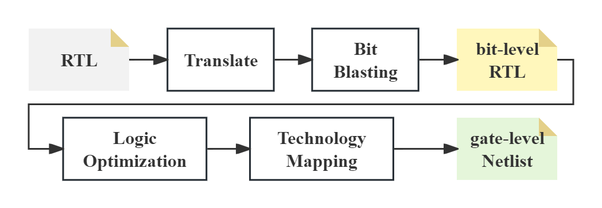
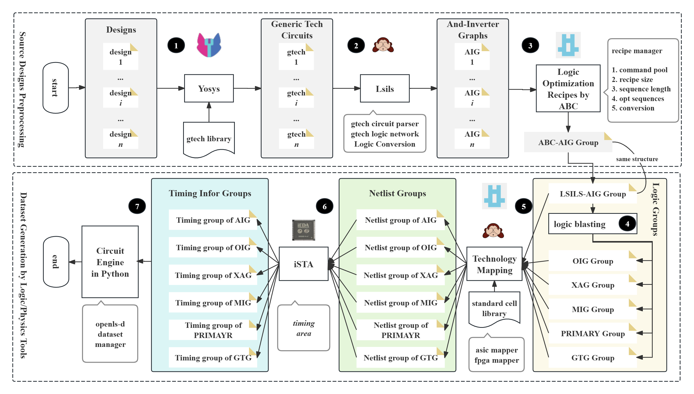
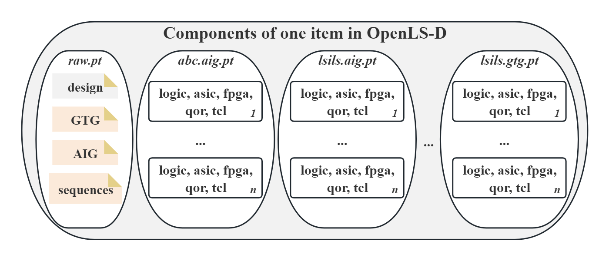
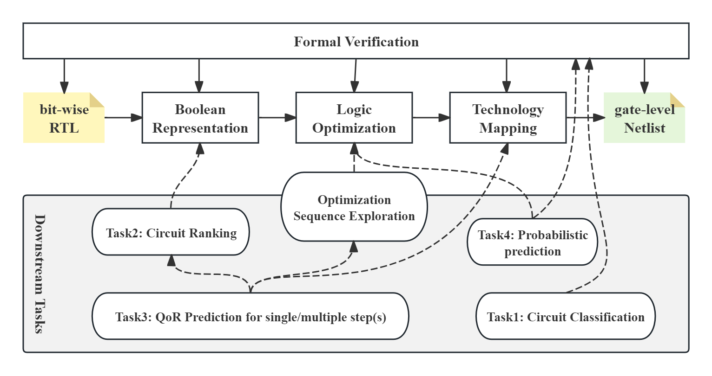
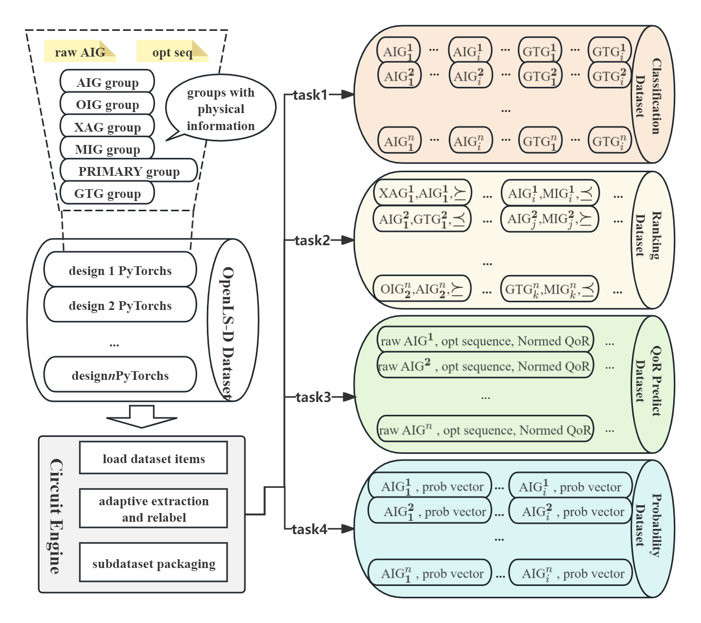

# OpenLS-DGF: Adaptive Logic Synthesis Dataset Generation Framework

### Logic Synthesis flow

<p align="center">
  
</p>
<p align="center">
  Fig. 1 Logic Synthesis Flow
</p>

Fig. 1 shows the background of OpenLS-DGF, the logic synthesis flow, which is the most important step in digital design automation. \
It covers the three fundamental steps in logic synthesis: Boolean representation, logic optimization, and technology mapping. \
The following description is under these three steps.

### OpenLS-DGF

<p align="center">
  
</p>
<p align="center">
  Fig. 2 Adaptive Dataset Generation Framework
</p>

Fig. 2 shows the framework of OpenLS-DGF, and we will introduce it in detail in the following paragraphs.

- **Step 1: Generic Technology Circuit Synthesis**

      The generic technology provides a general intermediate representation of the input RTL for different formats, which is very important for the translation step of logic synthesis.

- **Step 2: And-Inverter Graph Generation**

      Many logic optimization algorithms benefit from the AIG representation, therefore, we translate the generic technology circuit into AIG for the following logic optimization.

- **Step 3: Logic Optimization Recipes**

      The logic optimization recipes are used to optimize the AIG, and we use the following optimization algorithms: balance, rewrite, refactor, resub, and their variants.

- **Step 4: Logic Blasting**

      The logic blasting is used to translate the optimized AIG back to the other logic type of Boolean network such as XAG and MIG, which is an interesting topic for the technology mapping step.

- **Step 5: Technology Mapping**

      The technology mapping is used to translate the Boolean network to the target technology circuit, we both support the ASIC and FPGA technology mapping.

- **step 6: Static Timing Analysis~(Physical Design)**

      The static timing analysis is used to compute the arrival time of the critical path of the ASIC gate-level netlist. The other physical design tools are also allowed for this step.

- **Step 7: Dataset Packing**

      In this step, we use the AI Circuit Engine~(ACE) to facilitate the dataset packing.

<p align="center">
  
</p>
<p align="center">
  Fig. 3 The components of an item in Open-LS-D-v1.
</p>

Fig. 3 shows the components of an item in Open-LS-D-v1. \
It contains the original RTL, the generic technology circuit, the AIG, the optimized AIG, the logic blasting result, the target technology circuit, and the static timing analysis result. \
The different logic-related files are divided into different PyTorch files with one item.

### Synthesis Process

(1) **Tools Preparation**

- LogicFactory: \
      repo: [https://github.com/Logic-Factory/LogicFactory](https://github.com/Logic-Factory/LogicFactory)

      The LogicFactory is an open-source logic synthesis platform, which integrates the common logic synthesis tool to allow using commands across integrated tools. In this way, it combines the strengths of each tool to create a powerful toolchain for logic synthesis.

(2) **Techlibary Preparation**

you can find the prepared technology libraries at [../techlib/readme.md](../techlib/readme.md).

(3) **RTL Preparation**

The ''*../benchmark/openlsd*'' folder stores the used the input RTL benchmark. \
You can also prepare the desired RTL files in one folder for dataset generation.

(4) **Dataset Generation**

- **step 1: Install the requirements**

      pip install -r <path>/OpenLS-DGF/requirements.txt

- **step 2: Raw files generation**

      cd  <root>/OpenLS-DGF/
      python3 synthesis.py config.ini

- **step 3: Dataset packing**

      cd  <root>/OpenLS-DGF/
      python3 ../src/dataset/dataset.py config.ini <raw_files_folder> <recipe_size>

- optional: Equivalence Checking

      cd  <root>/OpenLS-DGF/
      python3 checking.py <raw_files_folder>

### Open-LS-D-v1

You can download the generated Open-LS-D-v1 dataset from the following links:

- Huggingface: *uploading...*

Filesystem of the Open-LS-D-v1 dataset:

```
OpenLS-D-v1
├── synthesis_sequence.txt
├── adder
├── ctrl
│   ├── raw.v
│   ├── raw.gtech.v
│   ├── raw.gtech.graphml
│   ├── raw.gtech.aig
│   ├── raw.gtech.aig.v
│   ├── raw.gtech.aig.graphml
│   ├── abc
│   │   ├── recipe_0.tcl
│   │   ├── recipe_0.seq
│   │   ├── recipe_0.logic.aig
│   │   ├── recipe_0.logic.v
│   │   ├── recipe_0.logic.graphml
│   │   ├── recipe_0.logic.qor.json
│   │   ├── recipe_0.fpga.v
│   │   ├── recipe_0.fpga.graphml
│   │   ├── recipe_0.fpga.qor.json
│   │   ├── recipe_0.asic.v
│   │   ├── recipe_0.asic.graphml
│   │   ├── recipe_0.asic.qor.json
│   │   ├── recipe_0.asic.qor.timing.json
│   │   ├── recipe_1.tcl
│   │   ├── ......
│   ├── ......
├── ......
├── processed_dir
│   ├── adder.raw.pt
│   ├── adder.abc.aig.pt
│   ├── adder.lsils.aig.pt
│   ├── adder.lsils.xag.pt
│   ├── adder.lsils.oig.pt
│   ├── adder.lsils.mig.pt
│   ├── adder.lsils.primary.pt
│   ├── adder.lsils.gtg.pt
│   ├── ctrl.raw.pt
│   ├── ......
```

### Downstream tasks

<p align="center">
  
</p>
<p align="center">
  Fig. 4 The interaction of the selected downstream tasks with the logic synthesis steps.
</p>

<p align="center">
  
</p>
<p align="center">
  Fig. 5 Adaptive sub-dataset extraction framworks of OpenLS-D-v1.
</p>

Fig. 4 shows the interaction of the selected downstream tasks with the logic synthesis steps. \
Fig. 5 shows the adaptive sub-dataset extraction frameworks of OpenLS-D-v1. \
You can find the task-related details at [../tasks/readme.md](../tasks/readme.md).

### How to cite

```
@misc{OpenLS-DGF,
      title={OpenLS-DGF: An Adaptive Open-Source Dataset Generation Framework for Machine Learning Tasks in Logic Synthesis}, 
      author={Liwei Ni and Rui Wang and Miao Liu and Xingyu Meng and Xiaoze Lin and Junfeng Liu and Guojie Luo and Zhufei Chu and Weikang Qian and Xiaoyan Yang and Biwei Xie and Xingquan Li and Huawei Li},
      year={2024},
      eprint={2411.09422},
      archivePrefix={arXiv},
      primaryClass={cs.AI},
      url={https://arxiv.org/abs/2411.09422}, 
}
```
