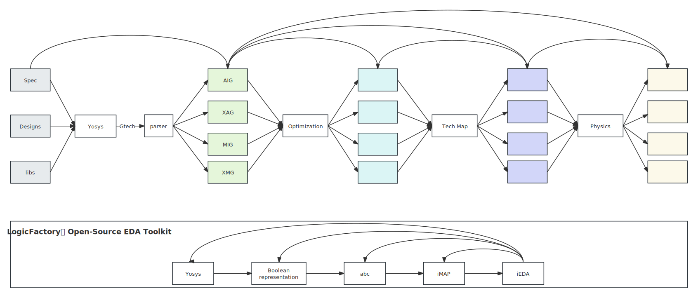

# Open Loigc Synthesis Dataset~(OpenLS-D)

```
Open Logic Synthesis Dataset~(OpenLS-D) bases on the Open Source EDA Toolkit.
The mission, and also the advantage of OpenLS-D is to learning the action of the open source tools.
```



### Components

- Boolean representation
  - AIG
  - XAG
  - MIG
  - XMG
- Logic Optimization
  - Optimization Sequence
  - QoR
- Technology mapping
  - FPGA
  - ASIC
- Physical Design
  - STA
  - Placement
  - Routing

### Application and demo

- Boolean representation learning
- Optimization Sequence Learning
- QoR prediction
- ...

### Dataset Generation

```
python3 src/synthesis_recipe.py --root_dir ./benchmark/kdd24/ --res_dir ./results/ --tool_abc ./tool/abc --tool_circuit_pool ./tool/circuit_pooling --tool_circuit2graphml ./tool/circuit2graphml --liberty ./src/liberty/sky130.lib --len_recipe_one 20 --len_recipe_all 500
```

### cite
