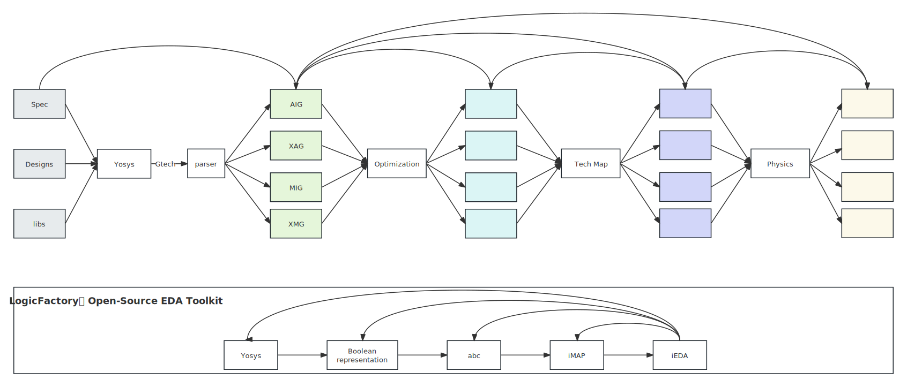

# Open Loigc Synthesis Dataset~(OpenLS-D)


Open Logic Synthesis Dataset~(OpenLS-D) bases on the Open Source EDA Toolkits, which are integrated in the [LogicFactory](https://github.com/Logic-Factory/LogicFactory) project.

The mission, and also the advantage of OpenLS-D is to learning the action of the open source tools.

There are mainly two parts in OpenLS-D:
- dataset generation
- AI engine

### Dataset Generation

```
python3 script/synthesis.py script/config.ini
```

### AI Engine


- circuit
  - AIG (And-Inverter Graph)
  - XAG (Xor-And Graph)
  - MIG (Majority-Inverter Graph))
  - XMG (Xor3-Maj3 Graph)
  - GTG (Gtech Graph)
- preprocessing
  - inverter
  - directed/undirected
- analysis
  - mffc
  - frequency
  - spectrum
  - dependency
- downstream tasks
  - representation learning
  - Boolean circuit pooling
  - classification
  - QoR prediction
  - design space exploration
  - next optimization learning
  - symbolic learning
  - propogation learning