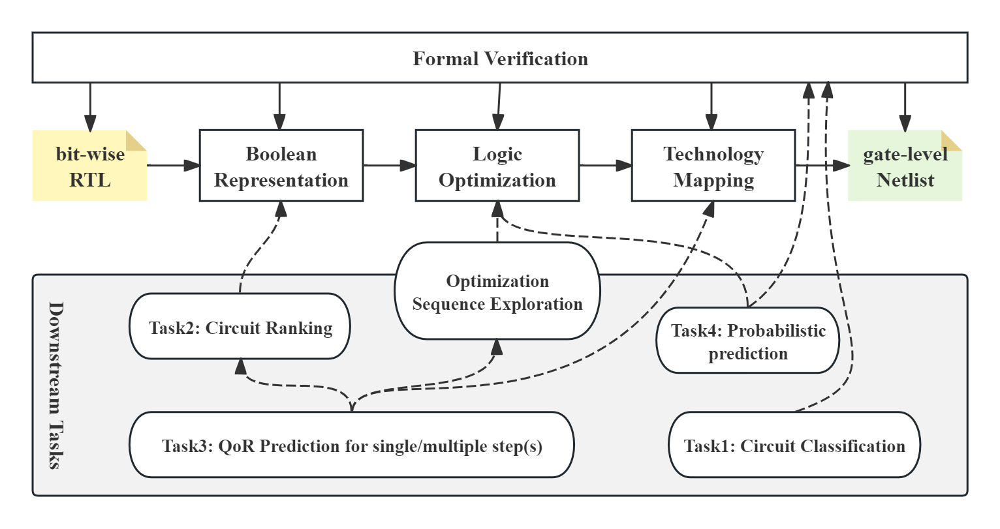

# ACE: AI Circuit Engine for Logic Synthesis

The ACE project provides a platform for machine learning tasks in logic synthesis. \
The mission of ACE is to provide a unified benchmark and framework for these tasks.

### Framework

  

  (a) ACE Framework

The above figure shows the ACE framework. \
Firstly, the LogicFactory tool generates the GraphML/Stats files of the Boolean circuits, including Boolean networks and ASIC/FPGA gate-level netlists. \
Then, the ACE's loader parsers GraphML files into the internal ''Circuit''/''Stats'' classes, and the operations such as conversions and simulations can be directly performed on the ''Circuit'' objects. \
The ACE also provides uniform neural network modules, which have the potential for benchmarking the related machine learning tasks.
Finally, the ACE can generate the desired dataset for the downstream machine-learning tasks in logic synthesis.

### Circuit Class

<table>
  <tr>
    <td align="center">
       
      (a) UML Diagram
    </td>
    <td align="center">
       
      (b) Node Correspondence
    </td>
  </tr>
</table>

Figure (a) shows the UML diagram of the Circuit class. \
The node's ``type``, ``index``, ``fanins``, and ``truth tables`` of the original Boolean circuit are dumped, which means that it has the potential to recover the original Boolean circuit without information lost. \
Furthermore, the ``Node`` class can represent the node in both the Boolean networks and ASIC/FPGA gate-level netlists. \
All these nodes are managed by the ``Circuit`` class, and the circuit operations can help us recompute the desired information.

Figure (b) shows the node correspondence between the original Boolean circuit, the ``Circuit`` on ACE, and the torch_geometric graph. \
The ``Circuit`` can be seen as the bridge between the original Boolean circuit and the AI-friendly torch_geometric graph. \
We can also leverage the advantages of the torch_geometric graph to make more graph operations and analysis on ``Circuit''.

### OpenLS-DGF: Adaptive Logic Synthesis Dataset Generation Framework

  

  (a) Adaptive Dataset Generation Framework

We also designed one adaptive dataset generation framework, which can generate one generic dataset for multiple downstream machine-learning tasks in logic synthesis. \
The details are discussed at [OpenLS-DDGF Folder](OpenLS-DGF/readme.md).

### Tasks

  

  (a) The background of the related downstream tasks

Figure (a) shows the background of the related downstream tasks. \
The details are discussed at [tasks Folder](tasks/readme.md).

### Tutorial

We also provide a series of tutorials for the users to learn how to use the ACE framework. \
It is mainly about the following parts:

- how to load the graphml/stats files
- how to operate the ``Circuit''
- how to generate the dataset
- how to run a downstream task
- ...

A tutorial is discussed at [tutorial Folder](tutorial/readme.md).
